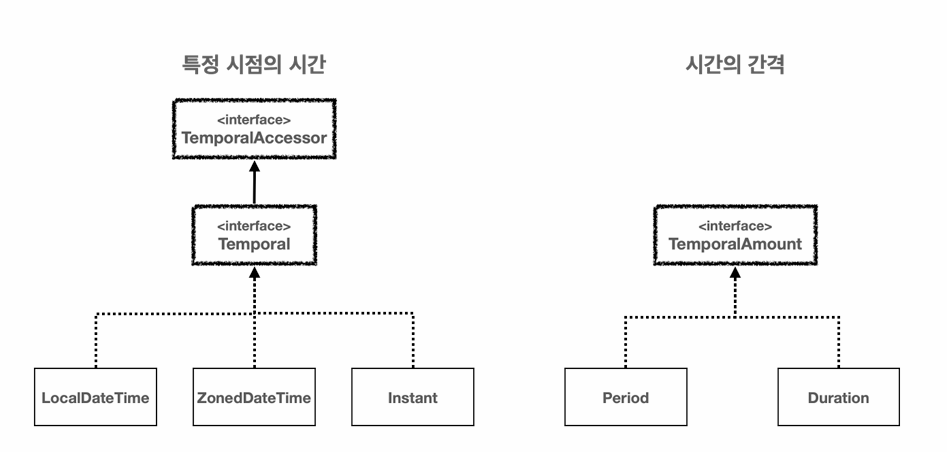

# 6. Date & Time

- 시간 라이브러리 필요 이유
    - 윤년, 각 달의 일수 등을 모두 고려.
    - 국가나 지역에 따른 ‘일광 절약 시간, DST’의 적용 (1시간 앞당기거나 늦추는 제도) 에 따라 오차 시간 발생.
    - 세계 각각의 타임존 구분. (Asia/Seoul +09:00)
        - GMT : 처음 세계 시간을 만들 때 영국 런던에 있는 그리니치 천문대를 기준으로 한 국제적인 시간 표준.
        - UTC : GMT를 대체하기 위해 도입. GMT와 동일하게 그리니치 천문대를 기준으로 하지만 UTC 는 원자 시계를 사용하여 측정된 국제적으로 합의된 시간 체계. 정밀한 시간 측정과 국제적인 표준에 관해서는 UTC가 선호됨.
- 시간 라이브러리 역사
    - JDK 1.0 (java.util.Date)
        - 문제점
            - 타임존 처리 부족
            - 불편한 날짜 시간 연산
            - 불변 객체 부제 : Date 객체는 변경 가능하여 데이터가 쉽게 변경될 수 있었음 → 버그 발생
    - JDK 1.1 (java.util.Calendar)
        - 해결
            - 타임존 처리 개선
            - 날짜 시간 연산을 위한 추가 메소드 지원
        - 문제점
            - 사용성 저하 : 사용하기 복잡하고 직관적 X
            - 일부 사용 사례에서 성능 저하되는 문제
            - 불변 객체 부제 : Calendar 객체도 변경 가능하여 사이드 이펙트, 스레드 안정성 문제가 있었다.
    - Joda-Time
        - 해결
            - 사용성, 성능, 불변성 문제 해결
        - 문제점
            - 자바 표준 라이브러리가 아니어서 프로젝트에 별도 추가를 해야함.
    - JDK 1.8 (java.time 패키지)
        - 해결
            - 이전 API 의 문제점을 해결하면서 사용성, 성능, 스레드 안정성, 타임존 처리 등에서 크게 개선됨.
            - Joda-Time의 개발자를 데려와서 JSR-310 (java.time) 이라는 새로운 자바 표준 날짜와 시간 라이브러리를 정의함.
- LocalDate, LocalTime, LocalDateTime
    - LocalDate : 날짜만 표현할 때 사용 / 년 월 일
        - 생성
            - .now() : 현재 날짜를 기준으로 생성
            - .of() : 특정 날짜를 기준으로 생성
        - 계산
            - .plusXXX() : 특정 기간을 더함 (일, 주, 월, 년)
            - .minusXXX() : 특정 기간을 뺌 (일, 주, 월, 년)
    - LocalTime : 시간만 표현할 때 사용 / 시 분 초
        - 생성
            - .now() : 현재 시간을 기준으로 생성
            - .of() : 특정 시간를 기준으로 생성
        - 계산
            - .plusXXX() : 특정 기간을 더함 (나노초, 초, 분, 시간)
            - .minusXXX() : 특정 기간을 뺌 (나노초, 초, 분, 시간)
    - LocalDateTime : LocalDate + LocalTime / 년 월 일 시 분 초
        - 위 세가지는 세계 시간대를 고려하지 않아서 타임존이 적용되지 않음.
        - 특정 지역의 날짜와 시간만 고려할 때 사용 → 예) 개발 시 국내 서비스만 고려할 때 등
        - 생성
            - .now() : 현재 날짜와 시간을 기준으로 생성
            - .of() : 특정 날짜와 시간를 기준으로 생성
        - 분리
            - 날짜 (LocalDate) 와 시간 (LocalTime)을 .toXXX() 으로 분리가 가능
        - 합체
            - 날짜 (LocalDate) 와 시간 (LocalTime)을 이용해서 LocalDatetime을 만들 수 있음
            - LocalDateTime.of(localDate, localTime)
        - 계산
            - .plusXXX() : 특정 기간을 더함
            - .minusXXX() : 특정 기간을 뺌
        - 비교
            - isBefore() : 다른 날짜시간과 비교한다. 현재 날짜와 시간이 이전이라면 true 를 반환
            - isAfter() : 다른 날짜시간과 비교한다. 현재 날짜와 시간이 이후이라면 true 를 반환
            - isEqual(), equals() : 다른 날짜시간과 시간적으로 동일한지 비교한다. 동일하면 true를 반환
                - isEqual() : 단순히 시간이 같으면 true 반환
                    - 예) 서울의 9시와 UTC의 0시는 동일 → true
                - equals() : 객체의 타입, 타임존 등 내부 데이터가 모두 같아야 true 반환
                    - 예) 서울의 9시와 UTC의 0시는 시간은 동일, but 타임존 다름 → false
- ZonedDateTime, OffsetDateTime
    - ZoneId : 자바에서 제공하는 타임존 클래스, 일광 적약 시간 관련 정보 포함
        - ZoneId.systemDefault() : 시스템에서 기본적으로 사용하는 ZoneId
        - ZoneId.of() : 타임존을 직접 입력해서 반환 받을 수 있음
    - ZonedDateTime : 시간대를 고려한 날짜와 시간을 표현할 때 사용, 타임존과 일광 절약 시간제와 오프셋을 포함 → 사용자 지정 시간대에 따른 시간 계산에 적합
        - LocalDateTime 와 ZoneId 가 합쳐진 것.
        - 2013-11-21T08:20:30.213+9:00[Asia/Seoul]
        - 생성
            - .now() : 현재 날짜와 시간을 기준으로 생성
            - .of() : 특정 날짜와 시간를 기준으로 생성
        - 타임존 변경
            - withZoneSameInstant(ZoneId) : 타임존을 변경 → 해당 타임존에 맞추어서 시간도 변경됨.
    - OffsetDateTime : 시간대를 고려한 날짜와 시간을 표현하지만 타임존이 포함되지 않고 일광 절약 시간제를 포함하지 않아 지역 시간대의 복잡성을 고려하지 않음 → 시간대 변환 없이 로그를 기록하고 데이터를 저장할 때 적합
        - LocalDateTime 와 UTC 오프셋 정보인 ZoneOffset이 합쳐진 것.
        - 2013-11-21T08:20:30.213+9:00
        - 생성
            - .now() : 현재 날짜와 시간을 기준으로 생성
            - .of() : 특정 날짜와 시간를 기준으로 생성
    - 참고
        - 위 두가지는 글로벌 서비스가 아니면 잘 사용하지 않음 → 너무 깊이있게 파지 말고 추후 실무에서 글로벌 서비스를 개발할 때 찾아서 사용하면 됨 ^^
- Year, Month, YearMonth, MonthDay
    - 년, 월, 년월, 달일 을 각각 다룰 때 사용. 자주 사용하지는 않음
    - DayOfWeek 와 같이 요일을 나타내는 클래스도 존재.
- Instant
    - UTC를 기준으로 경과한 시간을 나노초를 포함한 초 데이터로 나타냄.
    - UTC를 기준으로 계산하기 때문에 시간대의 영향을 받지 않으며 날짜와 시간 계산에는 적합 X
    - 시간의 경과 정도를 나타낼 때 사용가능
    - 장점
        - 시간대 독립성 : UTC를 기준으로 하므로 시간대의 영향을 받지 않음 → 전 세계 어디서나 동일한 시점을 가르킴
        - 고정된 기준점 : 기준이 명확하여 시간 계산 및 비교가 명확
    - 단점
        - 사용자 친화적 X
        - 시간대 정보 부재
    - 사용 예
        - 전 세계적인 시간 기준 필요 시: instant 는 UTC를 기준으로 하므로, 전 세계적으로 일관된 시점을 표현할 때 사용하기 좋다. 예를 들어, 로그 기록이나, 트랜잭션 타임스탬프, 서버 간의 시간 동기화 등이 이에 해당한다
        - 시간대 변환 없이 시간 계산 필요 시 : 시간대의 변화 없이 순수하게 시간의 흐름(예: 지속 시간 계산)만을 다루고 싶을 때 instant가 적합하다. 이는 시간대 변환의 복잡성 없이 시간 계산을 할 수 있게 해준다.
        - 데이터 저장 및 교환 : 데이터베이스에 날짜와 시간 정보를 저장하거나, 다른 시스템과 날짜와 시간 정보를 교환할 때 instant 를 사용하면, 모든 시스템에서 동일한 기준점(UTC)을 사용하게 되므로 데이터의 일관성을 유지하기 쉽다.
    - 생성
        - .now() :  UTC를 기준 현재 시간의 instant를 생성
        - .from() : 다른 타입의 날짜와 시간을 기준으로 instant 생성, UTC를 기준으로 하기 때문에 LocalDateTime 등은 사용 불가
        - .ofEpochSecond() : 에포크 시간을 기준으로 instant 를 생성 → 0 으로 생성하면 에포크 시간 기준인 1970년 1월 1일 0시 0분 0초 로 생성됨.
    - 계산
        - plusXXX() : 나노초, 밀리초, 초를 더함.
    - 조회
        - getEpochSecond() : 에포크 시간 기준으로 흐른 초를 반환.
- Period, Duration
    - 시간의 간격 (기간)을 표현하는데 사용.
    - Period : 두 날짜 사이의 간격을 년, 월, 일 단위로 나타냄
        - 생성
            - ofDays()
            - ofMonths()
            - ofYears()
        - 기간 차이
            - Period.between(startDate, endDate)
    - Duration : 두 시간 사이의 간격을 시, 분, 초 단위로 나타냄
        - 생성
            - ofSecond()
            - ofMinutes()
            - ofHours()
        - 기간 차이
            - Duration.between(start, end)
- 날짜와 시간의 핵심 인터페이스 _ TemporalAccessor, Temporal, TemporalAmount
    - TemporalAccessor : 날짜와 시간을 읽기 위한 기본 인터페이스
    - Temporal : TemporalAccessor 의 하위 인터페이스로 날짜와 시간을 조작(추가, 빼기 등)하기 위한 기능을 제공
        - TemporalAccessor 는 읽기 전용, Temporal 는 읽기 쓰기 모두 지원
        - LocalDateTime, LocalDate, LocalTime, ZonedDateTime, OffsetDateTime, Instant 등
    - TemporalAmount : 시간의 간격을 나타내며, 날짜와 시간 객체에 적용하여 그 객체를 조정 가능
        - Period, Duration 등
    
    
    
- 시간의 단위와 시간 필드 _ TemporalUnit(ChronoUnit), TemporalField(ChronoField)
    - TemporalUnit : 날짜와 시간을 측정하는 단위, 주로 사용되는 구현체는 열거형인 ChronoUnit.
    - ChronoUnit : 다양한 시간 단위를 제공.
        - 두 날짜 또는 시간 사이의 차이를 해당 단위로 쉽게 계산할 수 있음
        - Duration을 사용하기 때문에 초는 getSecound, 시, 일 은 toHours, toDays
        - 단순히 시간의 단위를 뜻함
    - TemporalField : 날짜와 시간을 나타내는데 사용
    - ChronoField :  날짜 및 시간을 나타내는 데 사용되는 열거형
        - 날짜와 시간의 각 필드 중 원하는 데이터 조회 가능
    - 위 두가지는 단독으로 사용하기 보다는 주로 날짜와 시간을 조작할 때 사용
    
    
    
- 날짜 시간 조회
    - LocalDateTime을 포함한 특정 시점의 시간을 제공하는 클래스는 모두 TemporalAccessor를 구현함.
    - get(TemporalField field) 를 통해 시간의 필드인 ChronoField 인수로 전달하면 사용 가능.
    - 자주 사용하는 필드는 편의 메소드 제공
        - 일반적으로 가독성을 위해 편의 메소드를 사용하고 편의 메소드가 없는 경우에는 get(TemporalField field)를 사용
    - 조회 시 LocalDate에 second를 조작은 불가능 → 시간 단위 없이 날짜 단위만 있음.
        - isSupported 제공 → 특정 시간 단위나 필드를 사용할 수 있는지 확인 가능
- 날짜와 시간 조작
    - 날짜와 시간을 조작하려면 시간 단위인 ChronoUnit이 사용됨
    - plus(long amountToAdd, TemporalUnit unit) 를 호출하여 기간과 단위(년, 월, 일 등) 를 전달하면 됨.
    - 불변이므로 반환값 필수
    - plus 뿐만 아니라 minus 도 존재
    - 자주사용하는 메서드는 편의 메서드 제공
    - Period나 Duration으로도 특정 시점의 기간을 더할 수 있음
    - Temporal.with() : 날짜와 시간의 특정 필드의 값만 변경 가능 → 반환값 필수
        - with는 단순 날짜만 변경 가능
    - 다음 금요일, 이번달 마지막 일요일 등 복잡한 계산은 TemporalAdjuster 사용
        - 자바에서 TemporalAdjusters구현체 제공
        - DayOfWeek 는 월 ~ 일 을 나타낸 열거형
- Formatting, Parsing
    - Formatting : Date → String
        - formatter 지정 후 String 으로 .format()
    - Parsing : String → Date
        - formatter 지정 후 Date 로 .parse()